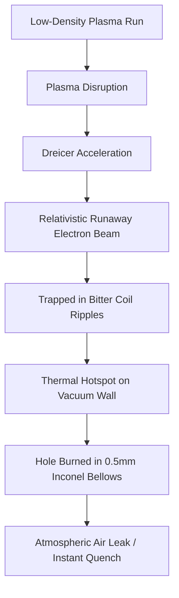
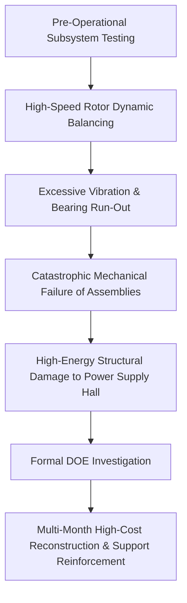
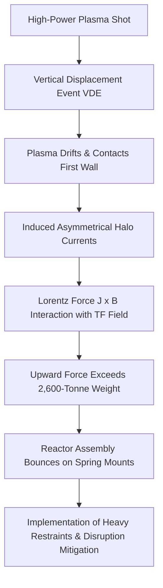
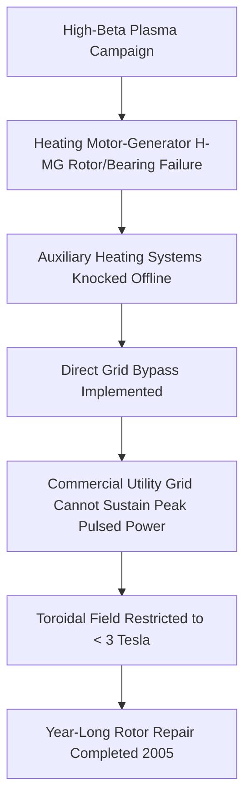
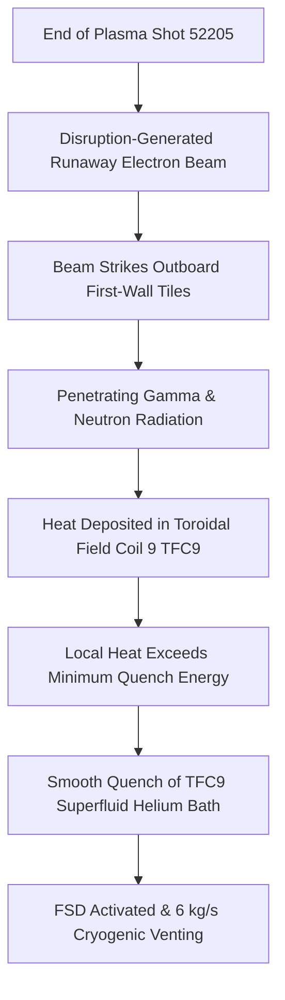
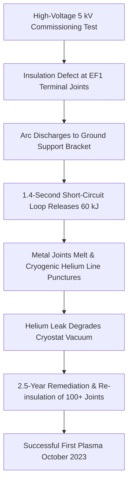

# Experimental Fusion Reactor "Fender Benders": A Historical Registry of Non-Thermonuclear Energetic Excursions

**Abstract**  
While magnetic confinement fusion facilities cannot undergo a runaway thermonuclear chain reaction or a Chernobyl-style core meltdown, they operate under extreme thermodynamic, structural, and electromagnetic conditions. An experimental fusion reactor is a complex process facility storing gigajoules of magnetic energy, managing volatile cryogenic fluids, operating at kilovolt-scale electrical potentials, and utilizing high-speed kinetic machinery to pulse its systems. When structural materials, electrical insulation, or control loops fail, these stored energies can release rapidly. This report catalogs the most notable historical "fender benders"—highly energetic, non-nuclear physical, mechanical, and cryogenic failures—in the history of experimental magnetic confinement fusion, from the 1973 TFR runaway-electron vessel burn-through through the 2021 JT-60SA high-voltage arc and cryogenic leak. Each incident is analyzed for technology baseline, chronology, damage, root cause, and remediation lessons relevant to commercial fusion engineering.

---

While magnetic confinement fusion facilities cannot undergo a runaway thermonuclear chain reaction or a Chernobyl-style core meltdown, they operate under extreme thermodynamic, structural, and electromagnetic conditions. An experimental fusion reactor is a complex process facility storing gigajoules of magnetic energy, managing volatile cryogenic fluids, operating at kilovolt-scale electrical potentials, and utilizing high-speed kinetic machinery to pulse its systems. 

When structural materials, electrical insulation, or control loops fail, these stored energies can release rapidly. To assist in evaluating engineering risks for future commercial deployments, this report catalogs the most notable historical "fender benders"—highly energetic, non-nuclear physical, mechanical, and cryogenic failures—in the history of experimental magnetic confinement fusion.

---

## 1. 1973 | TFR (Tokamak de Fontenay-aux-Roses, France)
### The "Runaway Electron" Vessel Burn-Through

#### The Technology & Design Baseline
The Tokamak de Fontenay-aux-Roses (TFR) was designed to drive plasma currents up to $400\text{ kA}$ [1]. It utilized a copper-shell-stabilized vacuum vessel with thin-walled ($0.5\text{ mm}$) Inconel bellows designed to minimize toroidal electrical resistance, while copper Bitter-type coils provided the primary confining toroidal magnetic field.

#### The Chronology of the Incident
During the summer of 1973, only months after achieving first plasma, operators conducted a series of low-density test runs [2]. Heavy metal impurities (specifically molybdenum from the limiter) contaminated the plasma, increasing resistivity and loop voltage driven by the ohmic heating transformer. 

The combination of a high electric field and low electron density triggered Dreicer acceleration [3]. This process accelerated a fraction of the bulk electron population to relativistic velocities, forming a localized runaway electron beam [2]. 

Due to the periodic variation in the toroidal magnetic field strength (toroidal field ripple) caused by the spacing of the Bitter coils, these runaway electrons became trapped in local magnetic mirrors, drifting directly outward along a deterministic path.

#### The Damage & Mechanical Impact
The runaway electron beam concentrated its thermal energy on a sub-centimeter spot of the inner vacuum vessel wall. The localized heat flux melted a hole directly through the $0.5\text{ mm}$ Inconel bellows, resulting in an immediate atmospheric air in-leak that quenched the remaining plasma [2].

#### The Root Cause Analysis
The primary cause was the generation of a high-current relativistic electron beam in a low-density, impurity-laden plasma regime [2]. This was exacerbated by a significant toroidal magnetic field ripple that directed the runaway electron beam into the thin bellows of the vacuum chamber.

#### Remediation & Lessons Learned
The incident required disassembly of the tokamak and fabrication of a replacement vacuum vessel. This event warned the global fusion community of the destructive potential of runaway electron beams, initiating decades of research into neoclassical transport, magnetic ripple transport, and active disruption mitigation techniques.

---

## 2. 1980 | TFTR (Tokamak Fusion Test Reactor, Princeton PPPL, USA)
### The Motor-Generator Structural Failure

#### The Technology & Design Baseline
The Tokamak Fusion Test Reactor (TFTR) relied on two vertical-shaft flywheel motor-generator (MG) systems to store kinetic energy and deliver pulsed power of up to hundreds of megawatts to its toroidal and poloidal magnetic coils [4]. Each generator unit featured a rotor weighing hundreds of tons designed to spin at speeds up to $375\text{ rpm}$ [5].

#### The Chronology of the Incident
On December 11, 1980, during pre-operational subsystem testing and dynamic balancing of the MG sets prior to first plasma, operators initiated a high-speed balancing run [4]. 

The structural assemblies of the primary Motor Generator Building were subjected to high mechanical stresses as the system was driven toward its commissioning thresholds.

#### The Damage & Mechanical Impact
The rotating components experienced mechanical instability, leading to a structural breakdown of the generator's bearing housings, shaft alignments, and balancing assemblies [4]. 

The resulting release of kinetic energy caused extensive physical damage to the power-supply hall. Because this incident occurred during pre-operational subsystem testing, no plasma was active, and no radioactive materials were present in the facility [4].

#### The Root Cause Analysis
An investigation by the Department of Energy (DOE) identified that high-speed rotor dynamic imbalances, combined with bearing run-out and insufficient structural dampening of the generator's foundation brackets, led to the mechanical failure under cyclic operational loads [4].

#### Remediation & Lessons Learned
The incident delayed TFTR operations and required a multi-month reconstruction of the pulsing power systems [4]. Engineers redesigned the rotor support structures, modified the liquid rheostats, and integrated supplementary bearings to manage vibration and bearing run-out at high speeds [5]. This repair process allowed TFTR to safely begin its plasma operations in December 1982.

---

## 3. 1980s–1990s | JET (Joint European Torus, Culham, UK)
### The 2,600-Tonne "Reactor Bounce"

#### The Technology & Design Baseline
The Joint European Torus (JET) is a large conventional tokamak with a total weight of approximately $2,600\text{ tonnes}$ [6]. To maximize plasma current and confinement, JET operates with elongated, non-circular plasma profiles. These shaped plasmas are inherently unstable to vertical displacements and rely on an active, high-speed vertical position feedback system to remain centered in the vacuum vessel [6].

#### The Chronology of the Incident
During high-power plasma campaigns, rapid transient events—such as edge-localized modes (ELMs) or sudden impurity influxes—frequently overwhelmed the active vertical feedback control loops [6]. This triggered Vertical Displacement Events (VDEs), where the entire plasma column drifted rapidly upward or downward until it contacted the vacuum vessel's first-wall tiles [8]. 

As the plasma boundary touched the first-wall panels, the electrical circuit between the plasma edge and the vessel wall closed, allowing massive, toroidally asymmetric "halo currents" to flow directly through the vessel structures and support elements [8].

#### The Damage & Mechanical Impact
These transient halo currents ($J$) interacted with the main toroidal magnetic field ($B$), generating massive, instantaneous, upward Lorentz forces ($J \times B$) [8]. In several high-power disruptions, the upward mechanical force exceeded the gravitational weight of the entire $2,600\text{-tonne}$ machine, physically lifting the reactor assembly and causing it to "bounce" several centimeters on its structural, shock-absorbing spring mounts [8]. The vertical and lateral shear forces strained structural weldments, diagnostic ports, and vacuum bellows [6].

#### The Root Cause Analysis
The rapid vertical drift of a highly energetic, elongated plasma column during a disruption led to the generation of large, asymmetric, and unmitigated halo currents [8]. The interaction of these currents with the strong background toroidal magnetic field created transient global forces that exceeded the design limits of the original structural supports.

#### Remediation & Lessons Learned
JET engineers implemented a mechanical upgrade of the facility, installing heavy external mechanical restraints, radial keys, and reinforced vacuum vessel supports [8]. This experience also catalyzed the development of active disruption mitigation systems—including massive gas injection (MGI) and shatter pellet injection (SPI)—designed to quickly dissipate plasma thermal and magnetic energy before asymmetric halo currents can develop [7].

---

## 4. 2004 | JT-60U (Naka, Japan)
### The Heating-System Motor-Generator Rotor Failure

#### The Technology & Design Baseline
The JT-60U tokamak utilized a dedicated vertical-shaft Heating Motor-Generator (H-MG) system equipped with a $300\text{-ton}$ flywheel [9]. Designed to deliver $400\text{ MVA}$ of pulsed electrical power and store $2.65\text{ GJ}$ of kinetic energy, the H-MG powered the facility's auxiliary neutral beam injectors (NBI) and radiofrequency (RF) heating systems [10].

#### The Chronology of the Incident
In February 2004, during a high-power plasma campaign designed to investigate high-beta plasma profiles, the H-MG system suffered a mechanical breakdown of its internal rotor and bearing assemblies while spinning at peak operating speed [9].

#### The Damage & Operational Consequence
The mechanical failure disabled the H-MG, immediately taking the auxiliary heating systems offline [10]. Because manufacturing and installing a new rotor had a lead time of over a year, engineers executed a bypass [9]. 

The auxiliary heating systems were re-routed to the Toroidal Field Motor-Generator (T-MG), while the Toroidal Field coils were connected directly to the local commercial utility grid.

#### The Root Cause Analysis
The mechanical failure was attributed to severe shaft vibrations and rotor winding stress caused by the highly cyclic, fast-pulsing duty cycles required for high-power plasma heating [9, 10].

#### Remediation & Lessons Learned
Although the bypass allowed JT-60U to resume operations, the commercial utility grid could not sustain the peak power surges required to operate the Toroidal Field coils at their full design strength [9]. 

As a result, the reactor's maximum magnetic field had to be restricted to under $3\text{ Tesla}$ (down from its $4\text{ T}$ design capacity) for the remainder of that operational campaign [9, 10]. The H-MG was repaired and returned to service in late 2005, restoring full-field capability.

---

## 5. 2017 | Tore Supra / WEST (Cadarache, France)
### The Runaway Electron-Induced Magnet Quench

#### The Technology & Design Baseline
Originally Tore Supra, later upgraded to the WEST divertor configuration, this tokamak utilized 18 niobium-titanium (Nb-Ti) toroidal field coils (TFC) cooled by a superfluid helium bath at $1.8\text{ K}$ [11]. The system is protected by an active Quench Detection System (QDS) coupled to a Fast Safety Discharge (FSD) system [11].

#### The Chronology of the Incident
On December 19, 2017, at the end of plasma run #52205, a sudden disruption generated a high-current beam of relativistic runaway electrons [11]. The electron beam escaped magnetic confinement and struck the outboard plasma-facing carbon-fiber composite tiles.

#### The Damage & Cryogenic Consequence
The collision of these highly energetic electrons with the first-wall tiles produced a localized flux of hard gamma-ray and neutron radiation [11]. This radiation penetrated the thermal shielding and deposited heat directly into Toroidal Field Coil 9 (TFC9). 

The sudden localized heat deposition exceeded the Minimum Quench Energy (MQE) of the superconducting winding, triggering a "smooth quench" in TFC9 [11]. The QDS responded correctly, triggering the FSD system to dump the magnet's stored energy into external series resistors [12]. The cryogenic relief system managed an expelled helium mass flow rate of nearly $6\text{ kg/s}$ over $5\text{ seconds}$ through its safety valves and rupture discs [12].

#### The Root Cause Analysis
The quench was caused by secondary radiation heating from an unmitigated runaway electron beam colliding with first-wall structures [11]. This highlighted the vulnerability of low-temperature superconducting coils to the penetrating radiation generated by runaway electrons, even when the coils are physically shielded behind thick vacuum vessel walls.

#### Remediation & Lessons Learned
Because the QDS and FSD systems functioned as designed, the magnet was successfully discharged without permanent damage and returned to nominal current operations [11]. The incident underscored the need for sensitive, secondary thermohydraulic monitoring (such as helium liquid level and pressure sensors) to detect "smooth" or slow-growing quenches in low-field regions of superconducting magnets [12].

---

## 6. 2021 | JT-60SA (Naka, Japan)
### The High-Voltage Arc and Supercritical Helium Leak

#### The Technology & Design Baseline
JT-60SA is a large superconducting tokamak utilizing niobium-titanium (Nb-Ti) coils cooled by pressurized, supercritical helium [15]. Its poloidal field system includes six Equilibrium Field (EF) coils designed to control plasma shaping and position [15, 16].

#### The Chronology of the Incident
On March 9, 2021, during integrated commissioning and initial high-voltage testing of the superconducting magnet systems, engineers initiated a $5\text{ kV}$ test on Equilibrium Field Coil No. 1 (EF1) [13]. 

An insulation defect where a diagnostic cable emerged from the coil terminal joints allowed a high-current path to form [14]. An electrical arc discharge formed between the positive terminal joint and its grounded support bracket, followed immediately by a second arc on the neighboring negative terminal joint [13]. These two arcs created a short-circuited loop that discharged for approximately $1.4\text{ seconds}$, releasing an estimated $60\text{ kJ}$ of energy [13].

#### The Damage & Cryogenic Consequence
The electrical arc melted several holes into the cylindrical metal joint of the coil, puncturing the pressurized helium cooling pipe [13]. Pressurized cryogenic helium leaked directly into the insulating vacuum cryostat, causing the vacuum to degrade from $10^{-3}\text{ Pa}$ to $7000\text{ Pa}$ and triggering a thermal quench of the magnet system [13]. A rupture disc on the helium cooling line released the venting helium gas safely into the torus hall [14].

#### The Root Cause Analysis
The investigation determined the root cause to be insufficient local electrical insulation at the terminal joints of the EF1 coil [14]. The factory-applied insulation technique was unable to withstand the high-voltage test conditions under vacuum, leading to electrical breakdown under high voltage stress [13, 14].

#### Remediation & Lessons Learned
The incident required a 2.5-year shutdown to warm the reactor, open the cryostat, repair the damaged joints, and redesign the insulation [15]. Engineers reinforced and re-insulated more than 100 electrical connections across the magnet systems [14, 15]. 

They also implemented extensive "Global Paschen Tests" (GPT) at varying vacuum levels within the cryostat to verify electrical insulation integrity before cooling the magnets back down [15]. The lessons learned from this remediation work were shared with the ITER project, and JT-60SA successfully achieved first plasma in October 2023 [16].

---

## Engineering and Safety Implications

The historical registry of these energetic excursions illustrates the shifting risk profiles of magnetic confinement devices as they have evolved from small, copper-coiled machines to large, superconducting facilities:

1. **Lorentz Force Mitigation:** Structural support frameworks must be engineered to withstand transient, mechanical shocks (such as Vertical Displacement Events) that can generate forces exceeding the physical weight of multi-thousand-tonne reactor assemblies [6, 8].
2. **Runaway Electron Containment:** High-current tokamaks require robust disruption mitigation systems (such as massive gas injection or shatter pellet injection) to instantly quench and diffuse runaway electron beams before they can damage vacuum vessels or trigger superconducting magnet quenches [7, 11].
3. **Insulation and Cryostat Integrity:** Superconducting joints operating at high voltages ($>5\text{ kV}$) require rigorous electrical isolation [13, 14]. A single insulation failure can lead to severe arcing, localized metal melting, and cryogenic leaks that can disable a facility for years [13].

These real-world events reinforce the reality that a primary challenge of commercial fusion reactor development is the mechanical, electrical, and thermal engineering required to survive these transient mechanical and electromagnetic stresses.

---

## Acknowledgements

The human authors retain sole responsibility for the historical claims, incident descriptions, citations, and conclusions in this registry. Following standard publisher practice (e.g., COPE guidance on authorship and AI tools [COPE24]), **no large language model is listed as a co-author**—authorship implies accountability that automated systems cannot bear.

We gratefully acknowledge assistance from the following tools:

**Cursor** ([Cur25]): agent-assisted editing in the Cursor IDE, including models routed through Cursor's **Auto** agent mode (which may invoke Composer-family and other backend models depending on task). These agents helped draft and revise incident narratives, convert failure-chain descriptions to Mermaid diagrams, and format mathematical notation. Generated text was treated as provisional until verified against primary sources and reviewed by the human authors.

**Google Gemini 3.5 Flash** ([Gem25]): independent technical briefs on tokamak disruption physics, runaway-electron damage mechanisms, motor-generator pulsed-power systems, and superconducting magnet quench protection. Those briefs informed subsequent human-directed revisions; we did not adopt every recommendation verbatim without cross-checking against the cited literature.

All factual claims, diagram semantics, and final prose were reviewed and owned by the human authors. Intellectual property in this note rests with the authors under the project's stated license.

---

## References

*   [1] Equipe TFR, "High-current discharges in the TFR device," in *Proceedings of the 5th International Conference on Plasma Physics and Controlled Nuclear Fusion Research*, Tokyo, Japan, 1974, IAEA-CN-33/A6-2.
*   [2] TFR Group, "Time and energy resolved runaway measurements in TFR from induced radioactivity," Association Euratom-CEA sur la Fusion, Fontenay-aux-Roses, Internal Report EUR-CEA-FC-1198, 1983.
*   [3] H. Dreicer, "Electron and ion runaway in a fully ionized gas," *Physical Review*, vol. 115, no. 2, pp. 238–249, 1959.
*   [4] United States Department of Energy, Office of Fusion Energy, "December 11, 1980 investigation report of the accident at the Princeton Plasma Physics Laboratory Tokamak Fusion Test Reactor Motor Generator Building," Washington, D.C., Report DOE/OFE-1981.
*   [5] E. de Haas et al., "TFTR Motor-Generator Operations and Upgrades," *IEEE Conference on Plasma Science*, 1981.
*   [6] JET Team, "Disruptions in JET," *Nuclear Fusion*, vol. 29, no. 4, pp. 509–516, 1989.
*   [7] M3D Team, "Reduction of asymmetric wall force in JET and ITER disruptions including runaway electrons," *Physics of Plasmas*, vol. 27, no. 2, 2020.
*   [8] P. Noll et al., "Forces on the JET vacuum vessel during disruptions and vertical displacement events," *Fusion Technology*, vol. 15, pp. 259–265, 1989.
*   [9] Japan Atomic Energy Agency (JAEA), "JT-60U Monthly Summary: July 2004 Modification of Power Supply System," National Institutes for Quantum Science and Technology (QST) Archives, 2004.
*   [10] JAEA, "Annual Report on Major Results and Progress of Fusion Research and Development Directorate of JAEA from April 1, 2004 to March 31, 2005," JAEA-Review 2006-023, 2006.
*   [11] Alexandre Torre, Daniel Ciazynski, Sylvain Girard, and Manuel Tena, "Tore Supra/WEST Toroidal Field Coil Quench Following a Plasma Disruption With Runaway Electrons," *IEEE Transactions on Applied Superconductivity*, vol. 29, no. 5, August 2019, Art. no. 4702805.
*   [12] S. Nicollet, A. Torre, S. Girard, et al., "Thermal-hydraulic analysis of Tore Supra / WEST TF Coil Quench," *Cryogenics*, vol. 106, 2020.
*   [13] K. Hamada et al., "Lessons Learned From EF1 Electrical Short Incident During JT-60SA Integrated Commissioning Test," *IEEE Transactions on Applied Superconductivity*, vol. 34, no. 5, August 2024, Art. no. 4200805.
*   [14] JT-60SA Project Management, "Integrated Commissioning Status on 09.07.2021: Root Cause and Recovery Measures of the EF1 Feeder Incident," Broader Approach Programme Report, July 2021.
*   [15] H. Shirai et al., "Overview of Construction and First Commissioning Results of JT-60SA Superconducting Magnets," *Nuclear Fusion*, vol. 64, no. 3, 2024.
*   [16] K. Tsuchiya et al., "Performance of JT-60SA Superconducting Magnet Operation in Integrated Commissioning Test," *IEEE Transactions on Applied Superconductivity*, vol. 35, no. 5, 2025.
*   [COPE24] Committee on Publication Ethics (COPE). (2024). Authorship and AI tools: COPE position statement. https://publicationethics.org/guidance/cope-position/authorship-and-ai-tools
*   [Cur25] Anysphere, Inc. Cursor: AI-native code editor and agent environment. https://cursor.com (accessed 2025).
*   [Gem25] Google DeepMind. (2025). Gemini model family (including Flash). Technical documentation and model cards. https://ai.google.dev/gemini-api/docs/models
