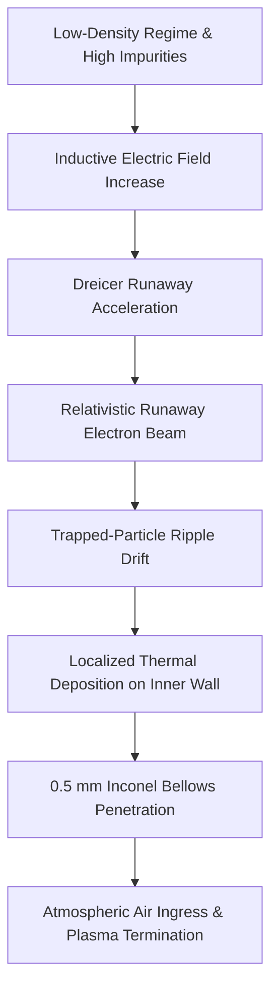
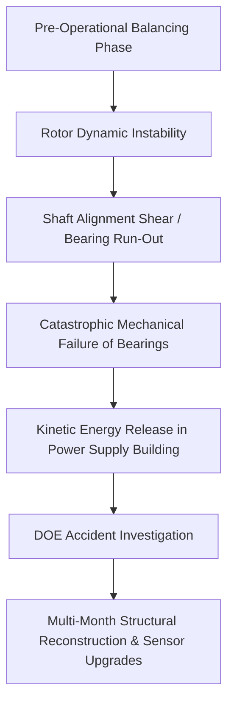
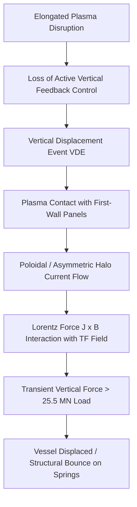
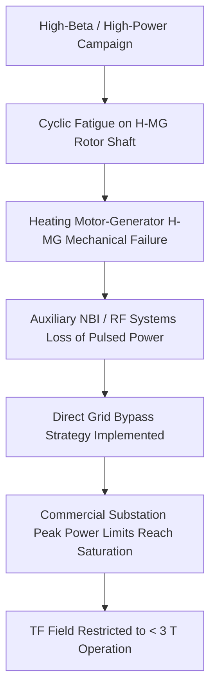
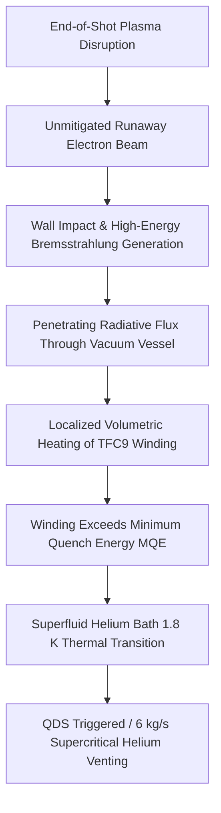
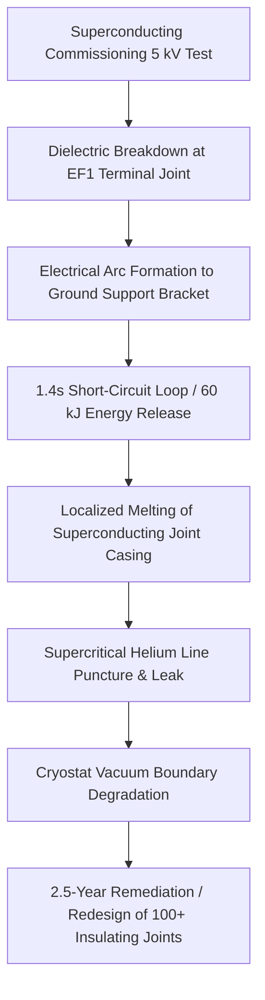

# Fusion Reactor Component Failures: A Review of Historical Non-Thermonuclear Energetic Excursions

**Abstract**  
While magnetic confinement fusion (MCF) devices are inherently safe from runaway thermonuclear chain reactions, they operate under high thermodynamic, structural, electromagnetic, and cryogenic energy densities. If containment boundaries, structural supports, or electrical insulation systems fail, these stored energies can release rapidly. This review compiles and analyzes six major historical structural and engineering component failures in experimental magnetic confinement devices: TFR (1973), TFTR (1980), JET (1980s–1990s), JT-60U (2004), Tore Supra/WEST (2017), and JT-60SA (2021). The physical mechanisms driving these events—including relativistic runaway electron generation, rotational kinetic imbalances, asymmetric halo currents, and dielectric breakdown in superconducting systems—are evaluated to inform the engineering design, safety margins, and risk mitigation strategies of future commercial fusion reactors.

---

## 1. Introduction

Unlike fission-based power systems, magnetic confinement fusion (MCF) reactors cannot undergo a runaway nuclear reaction or a core meltdown. The active plasma density in a tokamak or stellarator is extremely low, and any structural breach or loss of control leads to rapid cooling and immediate plasma termination. 

However, MCF reactors are highly complex, multi-system industrial facilities [1]. They store gigajoules of magnetic energy, maintain volatile cryogenic inventories, operate under high voltages, and require high-power kinetic components to drive pulsed operational scenarios. 

This paper catalogs and analyzes six notable historical operational excursions and structural failures in experimental magnetic confinement devices. These incidents demonstrate that while MCF facilities present minimal radiological risks, their structural, mechanical, cryogenic, and high-voltage systems are subject to significant electromagnetic and thermodynamic stresses. Understanding these historical failures is essential for defining the structural design limits, safety margins, and active mitigation architectures of future commercial fusion reactors.

---

## 2. Tokamak de Fontenay-aux-Roses (TFR, 1973): Localized Vacuum-Boundary Degradation via Relativistic Electron Beams

### 2.1 Technical and Design Baseline
Completed in 1973, the Tokamak de Fontenay-aux-Roses (TFR) was designed to drive plasma currents ($I_p$) up to $400\text{ kA}$ [1]. The vacuum boundary was maintained by a thin-walled ($0.5\text{ mm}$) Inconel bellows assembly to minimize toroidal electrical resistance during inductive startup. Toroidal magnetic field (TF) confinement was provided by copper Bitter-type coils [2].

### 2.2 Chronology of the Incident
During early low-density commissioning runs in 1973, the plasma became contaminated with molybdenum impurities sputtered from the limiter. This contamination increased the effective plasma charge ($Z_{\text{eff}}$), elevating plasma resistivity and the loop voltage driven by the ohmic heating transformer [2]. 

The resulting high toroidal electric field exceeded the threshold for Dreicer runaway acceleration [3], generating a population of relativistic electrons with kinetic energies of approximately $50\text{ keV}$ [2]. 

Due to the finite spacing of the Bitter coils, a periodic variation in the toroidal magnetic field strength (toroidal field ripple) was present. This ripple created local magnetic mirrors that trapped the runaway electrons, forcing them to drift radially outward along localized trajectories [2].

### 2.3 Physical Damage and Operational Impact
The collimated runaway electron beam deposited its thermal energy onto a sub-centimeter spot on the inner vacuum vessel wall. The localized thermal load exceeded the melting point of the material, burning a hole through the $0.5\text{ mm}$ Inconel bellows. The resulting atmospheric air ingress immediately terminated the plasma [2].

### 2.4 Root Cause and Remediation
The primary cause was the generation of a high-energy runaway electron population in a low-density, high-impurity regime, combined with toroidal field ripple that focused the beam onto a vulnerable section of the vacuum vessel [2]. 

The incident required a complete disassembly of the tokamak and the fabrication and installation of a replacement vacuum vessel. It served as the first major empirical warning regarding the localized destructive potential of runaway electron beams, initiating subsequent research into neoclassical ripple transport and disruption mitigation [1, 2].

---

## 3. Tokamak Fusion Test Reactor (TFTR, 1980): Kinetic Energy Release in Pulsed Power Flywheel Generators

### 3.1 Technical and Design Baseline
The Tokamak Fusion Test Reactor (TFTR) utilized two vertical-shaft flywheel motor-generator (MG) systems to store kinetic energy and deliver hundreds of megawatts of pulsed power to its non-superconducting copper magnet coils and neutral beam injectors [4]. The system was designed to buffer the local electrical grid from the high, cyclic power surges required during plasma pulses [4, 5].

### 3.2 Chronology of the Incident
On December 11, 1980, during pre-operational subsystem testing and high-speed dynamic balancing of the MG sets prior to first plasma, a major mechanical instability developed in one of the primary generator rotors [4]. The rotor was spinning at high velocity when excessive vibration and bearing run-out initiated a structural failure of the shaft and housing assemblies [4, 5].

### 3.3 Physical Damage and Operational Impact
The mechanical failure of the rotating assembly released significant kinetic energy within the primary Motor Generator Building at the Princeton Plasma Physics Laboratory (PPPL) [4]. The failure damaged the generator housing, stator assemblies, foundation mountings, and adjacent power distribution systems. 

Because the tokamak was in a pre-operational commissioning phase, no plasma was active, and no radiological materials (such as tritium) were present [4].

### 3.4 Root Cause and Remediation
A Department of Energy (DOE) investigation determined that the root cause was a combination of rotor dynamic imbalances and insufficient structural dampening of the generator's mounting brackets under high-speed cyclic load testing [4]. 

The incident required a multi-month, high-cost reconstruction of the pulsed power-supply systems. Engineers implemented reinforced concrete foundation brackets, upgraded the rotor dynamic balancing instrumentation, and added advanced vibration monitoring arrays to prevent recurring mechanical resonance [4, 5].

---

## 4. Joint European Torus (JET, 1980s–1990s): Disruption-Induced Vertical Forces and Halo Currents

### 4.1 Technical and Design Baseline
The Joint European Torus (JET) is a large conventional tokamak with a total assembly weight of approximately $2,600\text{ tonnes}$ [6]. To optimize beta limits and confinement, JET operates with highly elongated, non-circular plasma profiles. These configurations are vertically unstable and require high-speed, active vertical position feedback control [6, 8].

### 4.2 Chronology of the Incident
During high-power plasma campaigns, rapid transient events (such as edge-localized modes or impurity accumulation) occasionally overwhelmed the vertical feedback control system, triggering Vertical Displacement Events (VDEs) [6]. 

During a VDE, the plasma column drifts rapidly toward the top or bottom of the vacuum vessel. Upon contacting the plasma-facing components, the electrical circuit between the plasma boundary and the vessel structure is completed [8]. 

This allows large, toroidally asymmetric "halo currents" to flow directly through the vessel's metallic structural panels [8].

### 4.3 Physical Damage and Operational Impact
These transient halo currents ($J$) interacted with the background toroidal magnetic field ($B$), generating massive, instantaneous, upward Lorentz forces ($J \times B$) [8]. During extreme disruptions, the upward vertical force exceeded the gravitational load of the entire $2,600\text{-tonne}$ machine ($>25.5\text{ MN}$). 

This force physically lifted the reactor assembly, causing it to "bounce" several centimeters on its structural, shock-absorbing spring mounts [8]. The vertical and lateral shear forces strained structural weldments, diagnostic ports, and vacuum bellows [6].

### 4.4 Root Cause and Remediation
The root cause was the rapid, unmitigated vertical drift of a high-current, elongated plasma column, which generated asymmetric halo currents that coupled electromagnetically with the toroidal field [8]. 

JET engineers subsequently upgraded the vacuum vessel's structural supports, adding heavy external mechanical restraints and radial keys to limit lateral and vertical motion [8]. This experience catalyzed the development of active disruption mitigation systems—such as massive gas injection (MGI) and shatter pellet injection (SPI)—to pre-emptively quench the plasma before asymmetric halo currents can develop [7].

---

## 5. JT-60U (2004): Fatigue-Induced Rotor Failure in Heating Power Systems

### 5.1 Technical and Design Baseline
The JT-60U tokamak utilized a dedicated vertical-shaft Heating Motor-Generator (H-MG) system equipped with a $300\text{-ton}$ flywheel [9]. This system was designed to store $2.65\text{ GJ}$ of kinetic energy and deliver $400\text{ MVA}$ of pulsed electrical power to drive the facility's auxiliary neutral beam injection (NBI) and radiofrequency (RF) heating systems [10].

### 5.2 Chronology of the Incident
In February 2004, during a high-beta plasma campaign, the H-MG system suffered a mechanical breakdown of its internal rotor and bearing assemblies while operating at peak rotational speed [9]. The mechanical failure immediately disabled the auxiliary heating systems, halting the operational campaign [10].

### 5.3 Physical Damage and Operational Impact
The mechanical failure was localized within the generator facility, but repairing the $300\text{-ton}$ rotor and bearing system had an estimated lead time of over a year [9]. 

To avoid a prolonged shutdown, engineers bypassed the H-MG, re-routing the auxiliary heating systems to the Toroidal Field Motor-Generator (T-MG) and connecting the Toroidal Field coils directly to the local $275\text{ kV}$ commercial utility grid [9, 10].

### 5.4 Root Cause and Remediation
The failure was caused by mechanical fatigue and rotor winding stress under the highly cyclic, fast-pulsing duty cycles required for high-power plasma heating [9]. 

Although the bypass successfully restored auxiliary heating, the local commercial utility grid could not sustain the peak power surges required to run the Toroidal Field coils at full design strength [9]. Consequently, the reactor's maximum magnetic field had to be restricted to under $3\text{ Tesla}$ (down from its $4\text{ T}$ design capacity) for the remainder of the campaign [10]. The H-MG was repaired and returned to service in late 2005.

---

## 6. Tore Supra / WEST (2017): Runaway Electron Radiative Heating and Superconducting Magnet Quench

### 6.1 Technical and Design Baseline
Tore Supra (later upgraded to the WEST divertor configuration) utilized 18 niobium-titanium (Nb-Ti) superconducting toroidal field coils (TFC) cooled by a superfluid helium bath at $1.8\text{ K}$ [11]. The system was protected by an active Quench Detection System (QDS) and a Fast Safety Discharge (FSD) system [11].

### 6.2 Chronology of the Incident
On December 19, 2017, at the end of plasma run #52205, a major plasma disruption generated a high-current beam of relativistic runaway electrons [11]. The beam escaped magnetic confinement and struck the outboard plasma-facing carbon-fiber composite tiles [11].

### 6.3 Physical Damage and Operational Impact
The high-energy electron impact generated a localized flux of hard gamma-ray and neutron radiation via Bremsstrahlung [11]. This penetrating radiation bypassed the thermal shielding and deposited energy directly into the winding pack of Toroidal Field Coil 9 (TFC9). 

The sudden localized heat deposition exceeded the Minimum Quench Energy (MQE) of the superconducting winding, initiating a quench in TFC9 [11]. 

The QDS and FSD systems functioned as designed, discharging the magnet's stored energy into external series resistors [12]. The cryogenic relief system safely handled an expelled helium mass flow rate of nearly $6\text{ kg/s}$ over $5\text{ seconds}$ through its safety valves and rupture discs [12].

### 6.4 Root Cause and Remediation
The quench was driven by secondary radiation heating from an unmitigated runaway electron beam, demonstrating that superconducting coils are vulnerable to radiative energy deposition even when physically shielded by the vacuum vessel structure [11]. 

The magnet system was discharged without permanent damage and returned to nominal operations. The incident highlighted the necessity of integrated thermohydraulic and nuclear shielding models when designing magnet protection systems for steady-state tokamaks [12].

---

## 7. JT-60SA (2021): Dielectric Breakdown and Supercritical Helium Leakage

### 7.1 Technical and Design Baseline
JT-60SA is a large superconducting tokamak utilizing niobium-titanium (Nb-Ti) coils cooled by pressurized, supercritical helium [15]. The poloidal field system features six Equilibrium Field (EF) coils designed to control plasma shaping and position [15, 16].

### 7.2 Chronology of the Incident
On March 9, 2021, during integrated commissioning and high-voltage testing of the superconducting magnet systems, engineers initiated a $5\text{ kV}$ test on Equilibrium Field Coil No. 1 (EF1) [13]. 

An insulation defect where a diagnostic cable emerged from the coil terminal joints allowed a high-current path to form [14]. An electrical arc discharge formed between the positive terminal joint and its grounded support bracket, followed immediately by a second arc on the neighboring negative terminal joint [13]. These arcs created a short-circuited loop that discharged for approximately $1.4\text{ seconds}$, releasing an estimated $60\text{ kJ}$ of energy [13].

### 7.3 Physical Damage and Operational Impact
The electrical arc melted several holes into the cylindrical metal joint of the coil, puncturing the pressurized helium cooling pipe [13]. Pressurized cryogenic helium leaked directly into the insulating vacuum cryostat, degrading the vacuum from $10^{-3}\text{ Pa}$ to $7000\text{ Pa}$ and triggering a thermal quench of the magnet system [13]. A rupture disc on the helium cooling line released the venting helium gas into the torus hall [14].

### 7.4 Root Cause and Remediation
The investigation determined that the root cause was insufficient local electrical insulation at the terminal joints of the EF1 coil, which was unable to withstand the high-voltage test conditions under vacuum [14]. 

The incident required a 2.5-year shutdown to warm the reactor, open the cryostat, repair the damaged joints, and redesign the insulation [15]. Engineers reinforced and re-insulated more than 100 electrical connections across the magnet systems [14, 15]. 

They also implemented "Global Paschen Tests" (GPT) at varying vacuum levels within the cryostat to verify electrical insulation integrity before cooling the magnets back down [15]. The lessons learned from this remediation work were shared with the ITER project, and JT-60SA successfully achieved first plasma in October 2023 [16].

---

## 8. Comparative Analysis of Excursion Parameters

The physical parameters of these historical excursions illustrate the shifting risk profiles of magnetic confinement devices as they have evolved from small, copper-coiled machines to large, superconducting facilities:

| Year | Facility | Primary Driver | Energy Scale | Structural/Operational Consequence | Mitigation System Performance |
| :--- | :--- | :--- | :--- | :--- | :--- |
| **1973** | **TFR** | Relativistic Runaway Electrons | ~50 keV per particle | Localized vacuum-vessel bellows melt-through [2] | None (Disruption occurred before detection) |
| **1980** | **TFTR** | Kinetic Flywheel Instability | Multi-MJ (Mechanical) | Structural damage to generator housing [4] | Dynamic balancing instrumentation upgraded [5] |
| **1990s** | **JET** | Electromagnetic $J \times B$ Forces | $>25.5\text{ MN}$ vertical load | Displacement of the $2,600\text{-tonne}$ assembly [8] | Mechanical restraints and SPI/MGI installed [7, 8] |
| **2004** | **JT-60U** | Cyclic Mechanical Fatigue | $2.65\text{ GJ}$ stored kinetic | Generator offline; TF field limited to $<3\text{ T}$ [9] | Heating grid bypass implemented [10] |
| **2017** | **WEST** | Secondary Bremsstrahlung | Kilojoules (Volumetric) | Superfluid helium ($1.8\text{ K}$) coil quench [11] | QDS and FSD successfully discharged magnets [12] |
| **2021** | **JT-60SA** | Dielectric Insulation Failure | ~60 kJ (Electrical) | Supercritical helium leak; cryostat vacuum loss [13] | Rupture discs and Global Paschen Tests [14, 15] |

---

## 9. Discussion and Engineering Synthesis

The historical failures analyzed in this review highlight critical areas of engineering concern for future commercial-scale magnetic confinement reactors, such as ITER, DEMO, and private pilot plants:

1. **Electromagnetic and Mechanical Force Management:** Structural frame designs must account for large, transient asymmetric forces during vertical displacement events. Designing for gravity loads alone is insufficient; support structures must accommodate dynamic, multi-meganewton lateral and vertical loads to prevent structural displacement [8].
2. **Disruption Mitigation and Runaway Electron Suppression:** Runaway electron beams present a severe threat to vacuum boundary and magnet system integrity [2, 11]. Active suppression methods, such as shattered pellet injection (SPI) or active magnetic perturbation coils, must be integrated to prevent relativistic electron beams from localized wall impacts and secondary Bremsstrahlung heating of superconducting windings.
3. **High-Voltage and Cryogenic Insulation Integrity:** Superconducting magnets require high-voltage insulation that can withstand high potentials ($>5\text{ kV}$) under vacuum [13, 14]. A single localized insulation breakdown can lead to arc discharges, structural boundary breaches, cryostat vacuum loss, and thermal quenches, causing multi-year operational delays.

---

## Acknowledgements

The human authors retain sole responsibility for the historical claims, incident descriptions, citations, and conclusions in this registry. Following standard publisher practice (e.g., COPE guidance on authorship and AI tools [COPE24]), **no large language model is listed as a co-author**—authorship implies accountability that automated systems cannot bear.

We gratefully acknowledge assistance from the following tools:

**Cursor** ([Cur25]): agent-assisted editing in the Cursor IDE, including models routed through Cursor's **Auto** agent mode (which may invoke Composer-family and other backend models depending on task). These agents helped draft and revise incident narratives, convert failure-chain descriptions to Mermaid diagrams, and format mathematical notation. Generated text was treated as provisional until verified against primary sources and reviewed by the human authors.

**Google Gemini 3.5 Flash** ([Gem25]): independent technical briefs on tokamak disruption physics, runaway-electron damage mechanisms, motor-generator pulsed-power systems, and superconducting magnet quench protection. Those briefs informed subsequent human-directed revisions; we did not adopt every recommendation verbatim without cross-checking against the cited literature.

All factual claims, diagram semantics, and final prose were reviewed and owned by the human authors. Intellectual property in this note rests with the authors under the project's stated license.

---

## 10. References

*   [1] Equipe TFR, "High-current discharges in the TFR device," in *Proceedings of the 5th International Conference on Plasma Physics and Controlled Nuclear Fusion Research*, Tokyo, Japan, 1974, IAEA-CN-33/A6-2.
*   [2] TFR Group, "Time and energy resolved runaway measurements in TFR from induced radioactivity," Association Euratom-CEA sur la Fusion, Fontenay-aux-Roses, Internal Report EUR-CEA-FC-1198, 1983.
*   [3] H. Dreicer, "Electron and ion runaway in a fully ionized gas," *Physical Review*, vol. 115, no. 2, pp. 238–249, 1959.
*   [4] United States Department of Energy, Office of Fusion Energy, "December 11, 1980 investigation report of the accident at the Princeton Plasma Physics Laboratory Tokamak Fusion Test Reactor Motor Generator Building," Washington, D.C., Report DOE/OFE-1981.
*   [5] E. de Haas et al., "TFTR Motor-Generator Operations and Upgrades," *IEEE Conference on Plasma Science*, 1981.
*   [6] JET Team, "Disruptions in JET," *Nuclear Fusion*, vol. 29, no. 4, pp. 509–516, 1989.
*   [7] M3D Team, "Reduction of asymmetric wall force in JET and ITER disruptions including runaway electrons," *Physics of Plasmas*, vol. 27, no. 2, 2020.
*   [8] P. Noll et al., "Forces on the JET vacuum vessel during disruptions and vertical displacement events," *Fusion Technology*, vol. 15, pp. 259–265, 1989.
*   [9] Japan Atomic Energy Agency (JAEA), "JT-60U Monthly Summary: July 2004 Modification of Power Supply System," National Institutes for Quantum Science and Technology (QST) Archives, 2004.
*   [10] JAEA, "Annual Report on Major Results and Progress of Fusion Research and Development Directorate of JAEA from April 1, 2004 to March 31, 2005," JAEA-Review 2006-023, 2006.
*   [11] Alexandre Torre, Daniel Ciazynski, Sylvain Girard, and Manuel Tena, "Tore Supra/WEST Toroidal Field Coil Quench Following a Plasma Disruption With Runaway Electrons," *IEEE Transactions on Applied Superconductivity*, vol. 29, no. 5, August 2019, Art. no. 4702805.
*   [12] S. Nicollet, A. Torre, S. Girard, et al., "Thermal-hydraulic analysis of Tore Supra / WEST TF Coil Quench," *Cryogenics*, vol. 106, 2020.
*   [13] K. Hamada et al., "Lessons Learned From EF1 Electrical Short Incident During JT-60SA Integrated Commissioning Test," *IEEE Transactions on Applied Superconductivity*, vol. 34, no. 5, August 2024, Art. no. 4200805.
*   [14] JT-60SA Project Management, "Integrated Commissioning Status on 09.07.2021: Root Cause and Recovery Measures of the EF1 Feeder Incident," Broader Approach Programme Report, July 2021.
*   [15] H. Shirai et al., "Overview of Construction and First Commissioning Results of JT-60SA Superconducting Magnets," *Nuclear Fusion*, vol. 64, no. 3, 2024.
*   [16] K. Tsuchiya et al., "Performance of JT-60SA Superconducting Magnet Operation in Integrated Commissioning Test," *IEEE Transactions on Applied Superconductivity*, vol. 35, no. 5, 2025.
